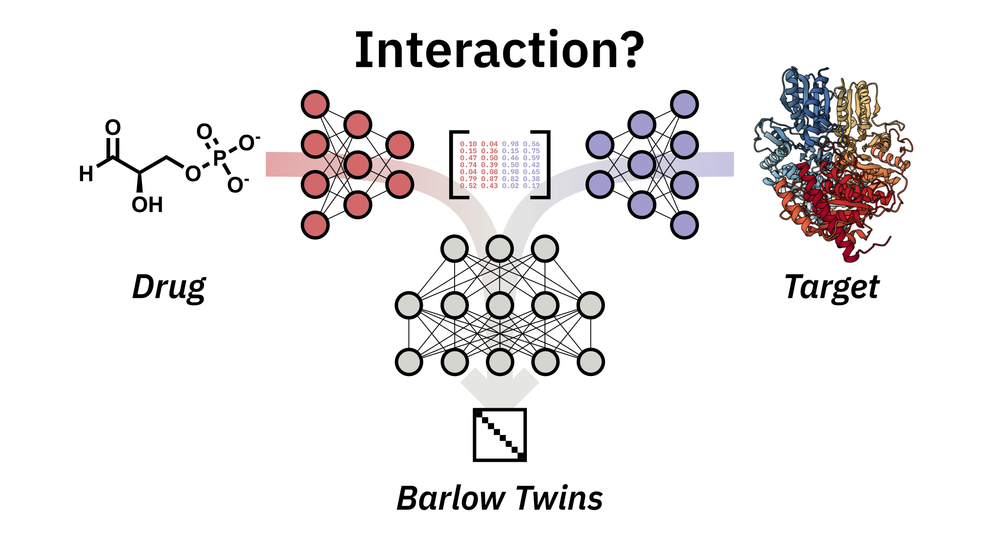

[](https://huggingface.co/spaces/mschuh/BarlowDTI)
[](https://doi.org/10.1186/s13321-025-00952-2)

# BarlowDTI

## Barlow Twins Deep Neural Network for Advanced 1D Drug–Target Interaction Prediction

Accurate prediction of drug–target interactions is critical for advancing drug discovery. 
By reducing time and cost, machine learning and deep learning can accelerate this laborious discovery process. 
In a novel approach, BarlowDTI, we utilise the powerful Barlow Twins architecture for feature-extraction while considering the structure of the target protein. Our method achieves state-of-the-art predictive performance against multiple established benchmarks using only one-dimensional input. 
The use of gradient boosting machine as the underlying predictor ensures fast and efficient predictions without the need for substantial computational resources. 
We also investigate how the model reaches its decision based on individual training samples. 
By comparing co-crystal structures, we find that BarlowDTI effectively exploits catalytically active and stabilising residues, highlighting the model’s ability to generalise from one-dimensional input data.
In addition, we further benchmark new baselines against existing methods. 
Together, these innovations improve the efficiency and effectiveness of drug–target interaction predictions, providing robust tools for accelerating drug development and deepening the understanding of molecular interactions. 
Therefore, we provide an easy-to-use web interface that can be freely accessed at https://www.bio.nat.tum.de/oc2/barlowdti.



## Code and Data

You can find our code and data stored in this repository.

If you use our work in your research, please cite:
```
@article{schuh2025barlow,
  title = {Barlow {{Twins}} Deep Neural Network for Advanced {{1D}} Drug--Target Interaction Prediction},
  author = {Schuh, Maximilian G. and Boldini, Davide and Bohne, Annkathrin I. and Sieber, Stephan A.},
  year = {2025},
  month = dec,
  journal = {Journal of Cheminformatics},
  volume = {17},
  number = {1},
  pages = {1--14},
  publisher = {BioMed Central},
  issn = {1758-2946},
  doi = {10.1186/s13321-025-00952-2},
  urldate = {2025-02-06},
  copyright = {2025 The Author(s)},
  langid = {english},
}

```
